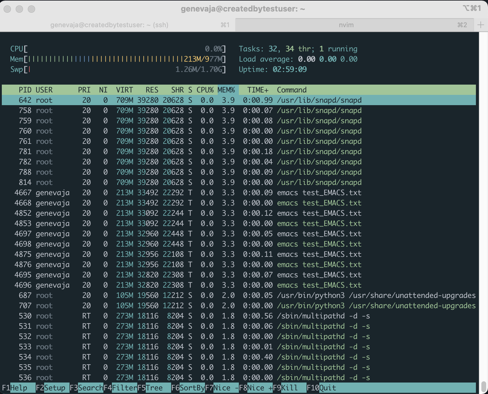
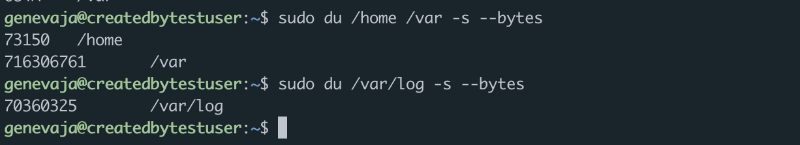

# D01\_Linux-0 genevaja

## Part 1. Установка ОС
- Скриншот вывода команды

- 

## Part 2. Создание пользователя
- Cоздание пользователя

- 
- Вывод файла /etc/passwd

- 
- Вывод информации о принадлежности к группам

- 

## Part 3. Настройка сети ОС
- Замена названия машины

- 
- Временная зона до и после изменений

- 
- Информация о сетевых интерфейсах

- 
- Сетевой интерфейс **lo**

lo (он же loopback) - сетевой интерфейс, который позволяет перенаправлять исходящий пакет на вход той же системы. Одна из возможностей применения - взаимодействие между локальными процессами через сетевую подсистему.
Loopback так же используется в стеке протоколов TCP/IP. Одна из областей применения - возможность попасть на, так сказать, сайт собственного компьютера при вводе http://127.0.0.1/ или http://localhost/. Такая страничка нужна для коммуникации с серверными приложениями.

- **DHCP**

DHCP (Dynamic Host Configuration Protocol) - позволяет автоматически получать данные о сети (IP-адрес, маску подсети, широковещательный адрес, шлюз, сервера имен и прочее). Это возможно при наличии DHCP сервера.
- Вывод на экран внешнего ip-адреса шлюза, внутренний ip-адрес

- 
- Замена ip на статичный

Для замены ip на статичный я отредактировал файл /etc/netplan/00-installer-config.yaml и прописал необходимые параметры

- 
- Финальный отчёт с результатами ping

- 

## Part 4. Обновление ОС
- Скриншот с выводом apt update

- 

## Part 5. Использование команды sudo
- **sudo**

Sudo (super user do) - программа, принимающая в качестве аргумента командную строку, выполняемую с правами root. Позволяет запускать программы от лица супер-пользователя. Чтобы пользователь мог выполнять команды sudo, он должен быть включён либо в специальную группу супер-пользователей, либо напрямую указан в файле /etc/sudoers

- Добавление группы adm в файл /etc/sudoers

Сначала я добавил группу adm в файл /etc/sudoers.
Затем при помощи команды su я авторизовался под testuser, которым внёс изменения в файле /etc/hostname
После перезагрузки системы, hostname поменялся

- 

- 

## Part 6. Установка и настройка службы времени

- 

## Part 7. Установка и использование текстовых редакторов

- EMACS

Для сохранения файла последовательно нажал ctrl-x ctrl-s. Для выхода ctrl-z

- 

- VIM

Для сохранения файла перешёл в командный режим и ввёл команду :wq

- 

- NANO

Для сохранения файла нажал ctrl-x и подтвердил название файла, в котором сохраняю текст

- 

- EMACS. Выход без сохранения 

Для выхода без сохранения изменения просто нажал ctrl-z
- 

- VIM. Выход без сохранения

Для выхода без сохранения в командном режиме ввел :q!
- 

- NANO. Выход без сохранения

Для выхода без сохранения нажал ctrl-x и "no" на предложение сохранить изменения.
- 

- EMACS. Поиск и замена слова

Для поиска и замены текста сначала нажал ESC затем нажал "x" и ввёл команду replace-string, после чего ввёл слово, которое хочу заменить и нажал enter. После чего ввёл слово, которое хотел вставить взамен и применил изменение глобально. После чего сохранил изменения
- 
- 
- 
- 
- 
- 

- VIM. Поиск и замена слова

Для поиска и замены текста воспользовался всего одной командой :s/SEARCH\_PATTERN/PATTERN\_TO\_REPLACE/g, где s (substitute) - команда для замены, а g (global) это глобальная замена по всему файлу
- 
- 
- 

- NANO. Поиск и замена слова

Для поиска и замены текста сначала нажал комбинацию ctrl-\ затем указал слово, которое хочу изменить. Нажал enter и написа слово, которое хочу поставить взамен и применил изменения ко всем совпадениям
- 
- 
- 
- 
- 
- 

## Part 8. Установка и базовая настройка сервиса SSHD

- Сначала надо установить ssh-server при помощи команды sudo apt install openssh-server.
- Затем необходимо включить ssh в автозагрузку демоном systemd. Это делается при помощи команды sudo systemctl enable ssh
- Затем ssh необходимо запустить при помощи команды sudo systemctl start ssh
- Для поиска процесса я воспользовался командой ps aux, где a - в значении all (отобразить все процессы). u - user oriented format (для отображения дополнительных полей). x - для отображения всех связанных процессов.
- Systemctl - это утилита, управляющая демоном systemd
- Для изменения порта для ssh я внёс соответствующую запись в файл /etc/ssh/sshd\_config
- netstat -tan. Команда выводит на экран содержимое различных структур данных, связанных с сетью. Флаг -t нужен для отображения только TCP портов. Флаг -a для отображения всех портов. Флаг -n заменяет слова на цифры. Например замена слова ssh на указание порта, используемого службой. Или замены слова localhost на ip-адрес. 
- 0.0.0.0 в поле локального адреса означает, что порт слушает все доступные сетевые интерфейсы
- 

## Part 9. Установка и использование утилиты top и htop
- 
- 
- uptime - непрерывное время работы системы с момента загрузки
- Авторизован 1 пользователь
- Общая загруженность системы 5 минут назад - 0.03 
- Общее количество процессов 103
- Загрузка CPU 0.0%
- Загрузка памяти 215.5МВ
- PID процесса, занимающего больше всего памяти 642 - это snapd (3.9%)
- PID процесса, занимающего больше всего процессорного времени 1 - это systemd (0.0)

- 
- 
- 
- 

## Part 10. Использование утилиты fdisk

- Диск /dev/sda 10GB 4 сектора. SWAP - 0. Его нет
- 

## Part 11. Использование утилиты df
- 

Размер раздела 9336140. Размер занятого пространства 4717260. Размер свободного пространства 4124904. Процент использования 54%.
Единицы измерения в Килобайтах.

- 

Размер раздела 9.0G. Занято 4.5G. Доступно 4.0G. Использовано 54%.
Файловая система ext4

## Part 12. Использование утилиты du
- 
- 
- 

## Part 13. Установка и использование утилиты ncdu
- 
- 
- 

## Part 14. Работа с системными журналами
- Время последней успешной авторизации 16:06. Пользователь genevaja. Метод входа в систему ssh2
- 
- 

## Part 15. Использование планировщика заданий CRON
- 
- 
- 
- 
